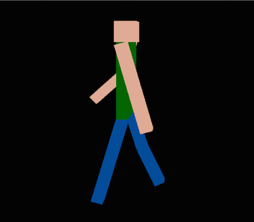

# notrealengine
Cross platform C++ 3D library (OpenGL) aimed to be simple, flexible and usable in multiple 42 projects (https://42.fr/en).

## Summary

* [Introduction](#introduction)
* [Technologies](#technologies)
* [Constraints](#constraints)
* [Features](#features)
* [Installation](#installation)
* [Authors](#authors)

## Introduction

This library was created to fill the [42 HumanGL](https://github.com/lnicosia/humangl) project requirements. Check its page to see the library in use!

The goal is to create an engine capable of printing 3D cubes of 1x1x1 in a hierarchical model, apply transformations to them to create a human character and most importantly apply animations to those members.
It was quickly decided that many more features would be usefull, for this project but also for the potential next ones. Shipping the features in an external library allows for more flexibility.

## Technologies

The library is coded in C++ and uses:

* [SDL](https://www.libsdl.org/) for windows and events handling.
* [glad](https://glad.dav1d.de/) for OpenGL loading.
* [Assimp](https://github.com/assimp/assimp) for model and animation loading.
* [stb image](https://github.com/nothings/stb) for image/texture loading.
* [Freetype](http://freetype.org/) for text rendering.

## Constraints

42 projects require to code everything from scratch, except for windows and events handling and OpenGL linking. Even though the project was delivered with SDL and glad only, the default compilation now uses assimp, stb image and freetype.
The library can still be compiled to use its own parsers instead.

## Features

### 3D engine

* Rendering of hierarchical objects with meshes and transformations.
* Skeletal and solid animations.
* Keyboard and mouse handling with generic events.
* Camera.
* Scene system with assets and point lights.
* Skyboxes.

### UI 

UI from scratch with buttons, generic UI elements and events.

### Bitmap font text rendering

Do tue 42 projects constraints, text printing needed to be coded from scratch.

### mft - Math library

Math library with vectors, matrices and quaternions. Once again, 42 rules did not allow to use external libraries like glm.

### PNG Parser

For the same reasons, custom PNG parser.

### LXML - Light XML Parser

Still no library allowed :). Required for collada parsing.

### Collada (.dae) object and animation parser.

The last parser that needed to be coded from scratch.

## Installation

Tested on Linux, Windows 10 and WSL (needs an X server like Xming).

OpenGL 4.0 is required (hence it is not going to work on Virtual Box's Linux machines since they can handle OpenGL 3.3 at most).

#### Linux, WSL

`clang` version compatible with C++20 is required.

Run `make`. That will produce a `libnre-external.a` static library that uses the external libraries mentioned above
Run `make libnre.a` to build the library without linking to any external library instead (except for SDL and glad).

#### Windows

Open and build the `Not Real Engine.sln`  solution file located in the `windows/` folder.
Choose between the configurations to build with or without external libraries.

## Authors

Neyl Jaber (https://github.com/42njaber)

Lucas Nicosia (https://github.com/lnicosia)
